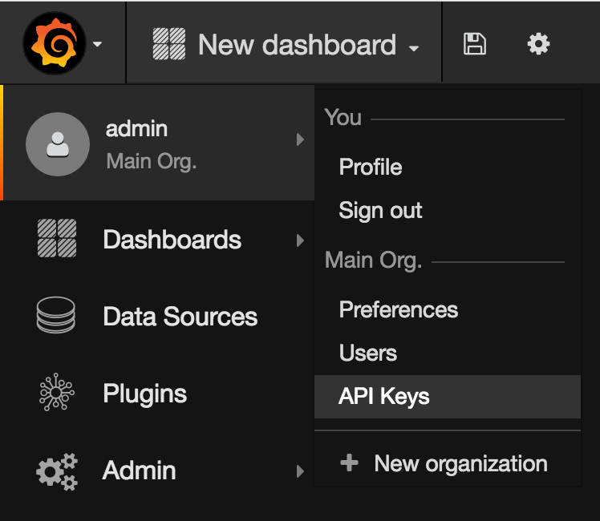
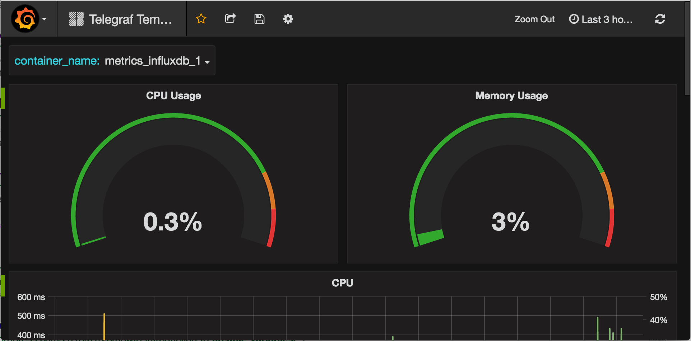
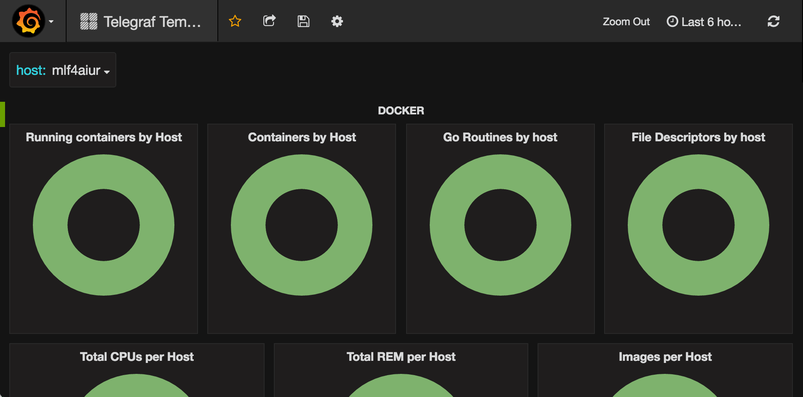
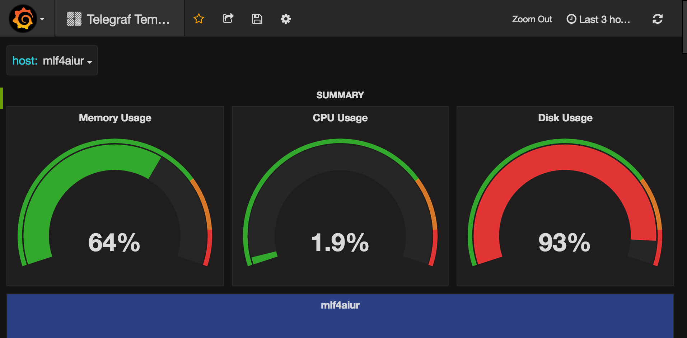
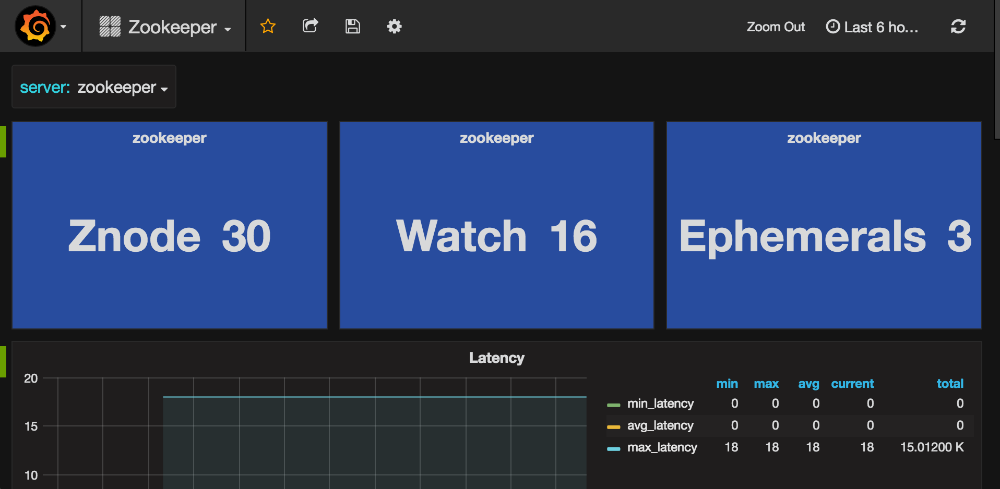
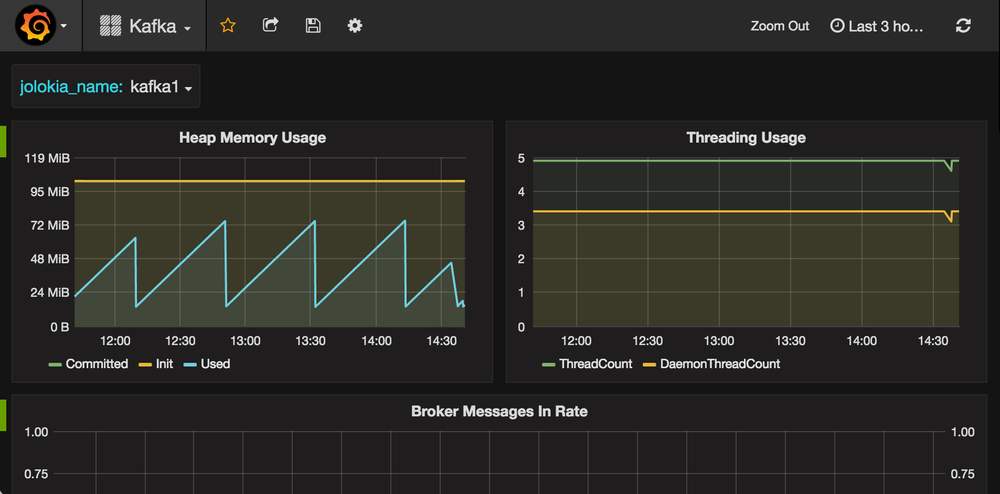

Metrics
=======

Monitor host, Docker, and applications resource metrics with [Grafana](https://grafana.net), [InfluxDB](https://influxdata.com/), and [Telegraf](https://influxdata.com/time-series-platform/telegraf/).

Urls:

* Grafana(admin/admin123): <http://localhost:3000>
* InfluxDB(admin/admin123): <http://localhost:8086>

Getting started
---------------

Setup this metrics stack needs to do something manually on the first time.

Clone the repository on GitHub:

    git clone https://github.com/mlf4aiur/Metrics.git

Create and start docker containers:

    cd Metrics
    docker-compose up -d

**Create Grafana "admin" api_key**

**Create new telegraf Datasource**

    grafana_host="localhost"
    token="Bearer your_api_key"

    curl -s \
      -XPOST \
      -H "Accept: application/json" \
      -H "Content-Type: application/json" \
      -H "Authorization: ${token}" \
      http://${grafana_host}:3000/api/datasources \
      -d @grafana/datasources/telegraf.json | python -m json.tool

**Create dashboard**

    ls grafana/dashboards/*.json | while read dashboard
    do
      echo ${dashboard}
      curl -s \
        -X POST \
      -H "Accept: application/json" \
      -H "Content-Type: application/json" \
      -H "Authorization: ${token}" \
      http://${grafana_host}:3000/api/dashboards/db \
      -d @${dashboard} | python -m json.tool
    done

**Install Grafana Pie Chart plugin**

    docker exec -t -i $(docker ps | awk /grafana/'{print $1}') grafana-cli plugins install grafana-piechart-panel
    docker exec -t -i $(docker ps | awk /grafana/'{print $1}') chown -R grafana:grafana /var/lib/grafana/plugins

    # Restart Grafana to enable new plugin
    docker-compose restart grafana

Dashboard screenshots
---------------------

Telegraf Templated Container:

Telegraf Templated Docker:

Telegraf Templated Host:

Zookeeper:

Kafka:

